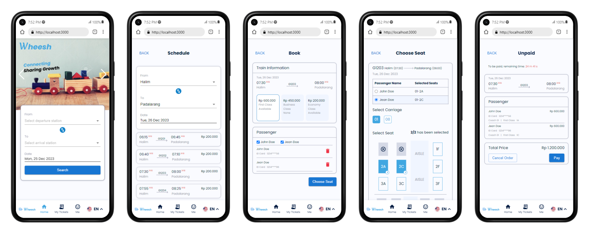
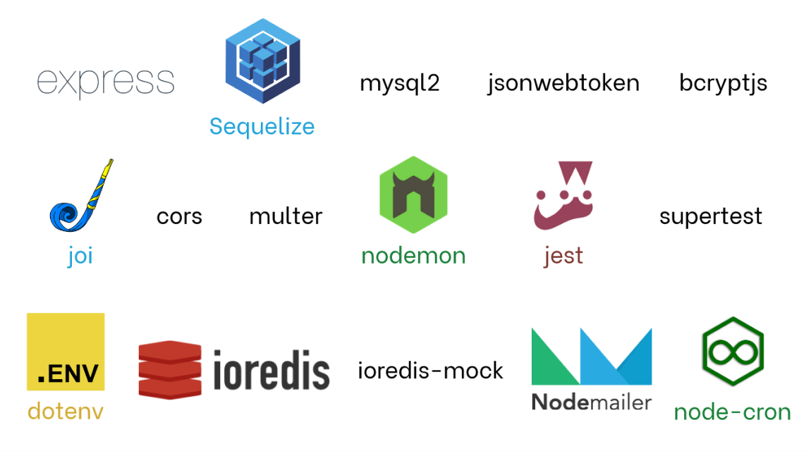
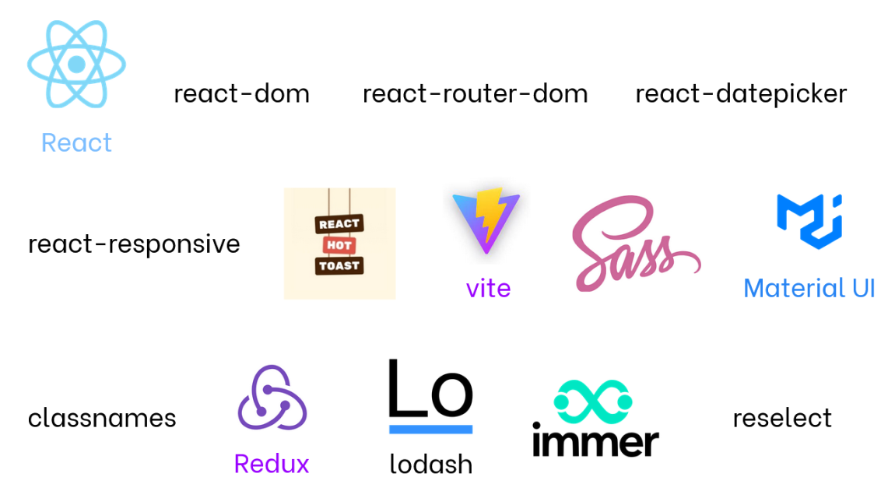
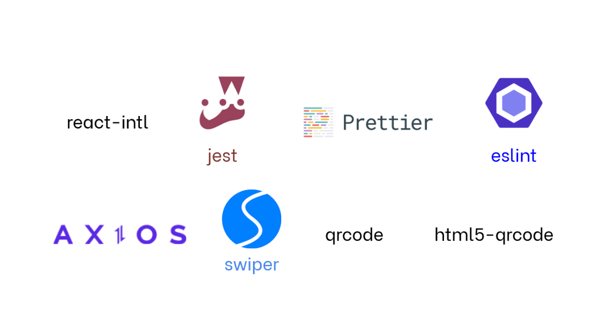
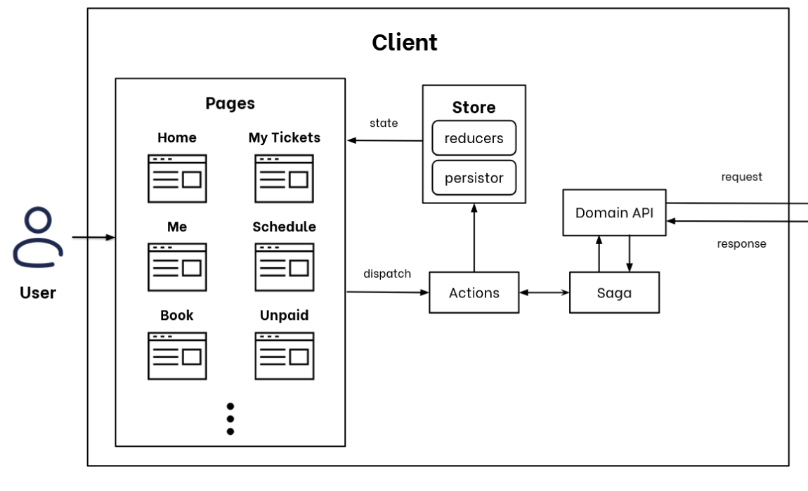
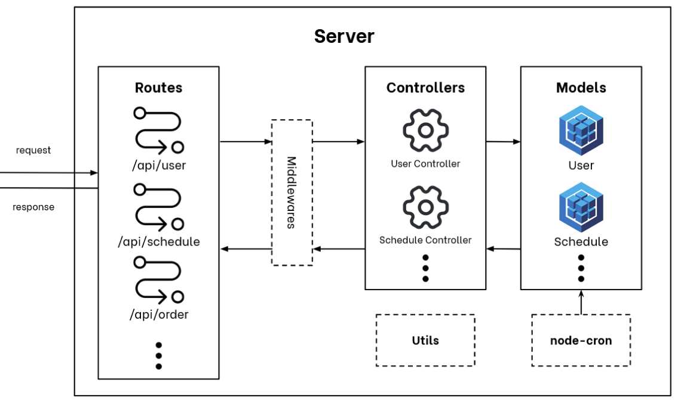

# Wheesh

Wheesh is a prototype website that helps people to book train tickets online.
There are 10 features:
1. Registration and Login
2. Profile Management
3. Account Security (Change Email, Change Password)
4. Manage My Passengers
5. Banner Management (By Admin)
6. Schedule
7. Ticketing (Booking Ticket, _Pay Order_ (not implementing payment gateway), Cancel Order)
8. See Orders (Unpaid Orders, Paid Orders, History Orders)
9. QR Validation  
   The QR Validation is on `Gate` page
10. Reminder  
    Remind user about one hour before departure via email



## How to Setup

### Server

1. Create `uploads` folder on `server` folder
2. Copy these files from `backupPics` to `public` folder
   ```
   Frame 1 - Desktop.png
   Frame 1 - Mobile.png
   Frame 2 - Desktop.png
   Frame 2 - Mobile.png
   Frame 3 - Desktop.png
   Frame 3 - Mobile.png
   Frame 4 - Desktop.png
   Frame 4 - Mobile.png
   Frame 5 - Desktop.png
   Frame 5 - Mobile.png
   ```
3. Setup `.env` file
   ```
   PORT=<PORT>
   JWT_SECRET=<JWT_SECRET>
   CRYPTO_KEY=<CRYPTO_KEY>
   USERNAME_NODEMAILER=<EMAIL_THAT_IS_SET_TO_SEND_EMAIL>
   PASSWORD_NODEMAILER=<PASSWORD_EMAIL_FOR_SEND_EMAIL>
   ```

4. Setup the database
   ```
   npx sequelize-cli db:drop
   npx sequelize-cli db:create
   npx sequelize-cli db:migrate
   npx sequelize-cli db:seed:all
   ```

### Client

No need to setup anything, but if the style of the website is weird, try to delete the local storage of the website (`localhost:3000`) to reset the theme to be `light`.

## How to Run

### Server

1. Run the redis-server

2. Run the backend
   ```
   npm run dev
   ```

### Client

```
npm start
```

## How to test

### Server

1. Setup the database first (no need to repeat this step after migrate the **test** database)
   ```
   npx sequelize-cli db:drop --env test
   npx sequelize-cli db:create --env test
   npx sequelize-cli db:migrate --env test
   ```

2. Run the test
   ```
   npm run test
   ```

### Client

```
npm run test
```

## Server Documentation

Click this [link](server/ReadMe.md) to read the API Documentation

## Client Routes

For detailed information about the client routes, please refer to the [Client Routes README](./client/README.md).

## Tech Stack

Summary of what the stack looks like on each side:

### Backend

Tech stacks:
1. express, framework that helps developing backend (or server)
2. sequelize, an ORM (Object Relational Mapping)
3. mysql2, helps connecting sequelize with MySQL driver
4. jsonwebtoken, helps creating token and validating token for authentication
5. bcryptjs, helps hashing and check the password is the same with hash password
6. joi, helps validating the request body's structure and some special conditions (e.g. validate format of `ID Card`)
7. cors, helps enabling CORS on backend
8. multer, handle uploading files from client
9. nodemon, helps developing backend (by restart the server when the codes are changed)
10. jest, help testing in Javascript
11. supertest, help testing HTTP requests
12. dotenv, help storing sensitive information without hardcoding them directly into source codes
13. ioredis, do the caching
14. ioredis-mock, mock the `ioredis` when testing
15. nodemailer, help sending email
16. node-cron, automate some jobs in periodic time



### Frontend

Tech stacks:
1. React, framework for creating user interfaces
2. react-dom, serves as the entry point to the DOM and server renderers for React
3. react-router-dom, contains bindings for using React Router in web applications
4. react-responsive, helps coding media query inside Javascript codes
5. react-hot-toast, helps notificating user on user interfaces
6. vite, helps faster developing / coding on frontend
7. sass, helps custom styling
8. Material UI, helps styling
9. classnames, helps styling
10. Redux, helps state management (to reduce number of passing `props`)
    - react-redux, helps implementing `redux` in `React` app
    - redux-saga, do the side effects of redux (e.g. fetching data)
    - redux-persist, helps storing some states of `reducer` in local storage
11. lodash, helps delivering modularity in Javascript
12. immer, helps changing state in `reducer` (by using `produce` method)
13. reselect, helps data handling (`createSelector` on all `selectors.js` and `createStructuredSelector` on all `index.jsx`)
14. react-intl, helps internationalize React applications
15. jest, helps testing in Javascript
16. prettier, helps tidying up the source codes
17. eslint, helps identifying and reporting on patterns found in ECMAScript/JavaScript code
18. axios, helps making HTTP requests
19. swiper, helps making carousel of banners
20. qrcode, helps generating QR code
21. html5-qrcode, helps scanning QR code on user interface




## Program Flow

### Client (or Frontend)

When a user opens a page, certain pages necessitate fetching data from the server initially. The page triggers an `action` bound to a `constant`—all variables in `constants.js` specific to each page—to execute the corresponding method in the `saga` for the required logic. The `saga` method, in turn, invokes the corresponding method in the domain API to send an HTTP request to the server for data retrieval. Upon receiving the response, the domain API sends it back to the `saga` method, which, in turn, triggers another `action` to update the `reducer`'s `state` within the `store`. Consequently, the page reflects the fetched data through its updated `state`.

Similarly, when a user initiates a create, update, or delete operation, the page again triggers an `action` to execute the corresponding logic in the `saga`. This `saga` method, similar to the data fetching scenario, calls the relevant method in the domain API to send an HTTP request for creating, updating, or deleting something on the server. The domain API, upon receiving a response, sends it back to the `saga` method. Subsequently, the `saga` method triggers an additional `action` to modify the `reducer`'s `state` within the `store`. The page then reflects the updated `state` accordingly.

 

### Server (or Backend)

When a request is sent to the server, it follows a specific route. Some routes directly invoke a method within the `controller`, while others pass through various middlewares before reaching a method inside the `controller`. For instance, when a client requests profile data via the `/api/user` endpoint, the request is initially directed to the `authentication` middleware to verify the presence and validity of an authorization token. If the request fails within the `authentication` middleware, a `BAD REQUEST` response is sent to the client. Otherwise, the request proceeds to the specified method within the controller. Within these controller methods, distinct logic is implemented for various purposes. For example, on the `/api/user` endpoint, the method might execute a query using `sequelize`'s `Model` to retrieve user data and subsequently send a response containing the profile data to the client. Additionally, some controller methods utilize utility methods for specific logic, such as hashing passwords or creating authorization tokens.

The `node-cron` module consistently executes its tasks periodically. These tasks typically involve querying the database and potentially updating its contents. For instance, the `deleteNotPaidOrderPassedDueTime` job is responsible for removing unpaid orders that have exceeded their due time. If certain conditions are met, this job will delete the corresponding order from the database.

